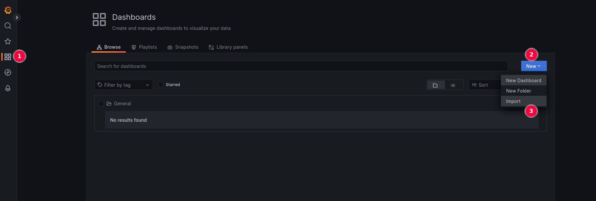
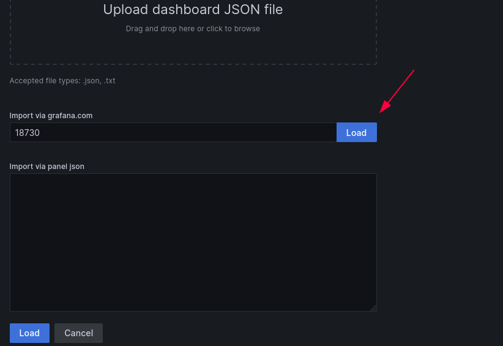
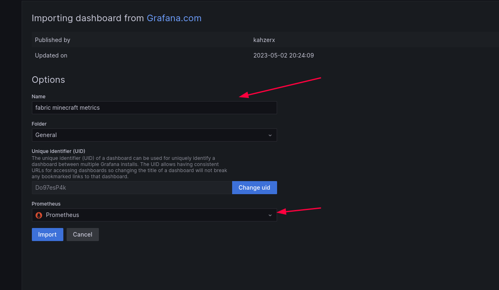

# Deploy

## Install the mod

The mod is currently only available for fabric, you can find the mod here https://github.com/BlackLotus-SMP/MetricsProtocol/releases

The mod will be collecting and exporting metrics on the port the server is normally **listening** to, **in the server-port** set in the `server.properties`.

## Deploy the prometheus stack + exporter

### Configure the exporter

Modify the [DockerfileMetrics](https://github.com/BlackLotus-SMP/MetricsExporter/blob/master/docker/DockerfileMetrics#L19) setting **your own mcAddress, mcPort and interval** to collect metrics(in seconds).

### Configure prometheus

Modify the [prometheus yaml](https://github.com/BlackLotus-SMP/MetricsExporter/blob/master/docker/prometheus.yml#L25) and set the **interval you want prometheus to scrape metrics** from the exporter(You probably want the same interval as the exporter).

### Configure grafana

Modify the [docker compose](https://github.com/BlackLotus-SMP/MetricsExporter/blob/master/docker-compose.yml#L24) and set your own **secure password for the grafana admin user**.

## Run the service

You can run the process with
```bash
docker-compose up -d --build
```

And access grafana on `http://<your-ip>:3050`

Default user: **admin**

Default pass: **whatever you set on [Configure grafana](https://github.com/BlackLotus-SMP/MetricsExporter/blob/master/docs/README.md#configure-grafana)**

## Import the dashboard

- Log in with you admin creds into grafana, click on dashboards and import a new dashboard.



- Import the dashboard with id: **18730**



- Configure the dashboard

- Set the name, and prometheus source, you should have one in the dropdown menu



- And click on Import
